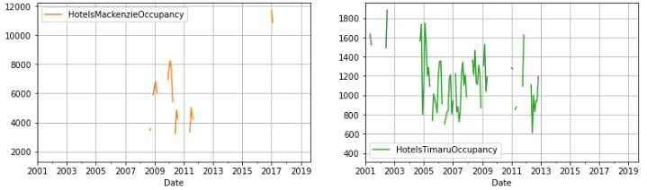

# Tourism Forecasting Project

Forecasting tourism and visitor can be challenging for a variety of reasons but accurate forecasts could give governments and industry a great indicator to economic health. As we exit the COVID-19 Pandemic, rapidly adapting time series models are even more important as data can be heavily skewed. In this capstone, I walk through the different steps of how I created a myriad of time series models and how I managed each one.

Some notes on the project:

There is a requirements file in the main github folder. It is recommended to create a separate environment for pycaret due to the dependencies needed at the time for pycaret 2.3 and the pycaret nightly 2.2.2. In the [Requirements and Docs](/Requirements%20and%20Docs) folders are different requirements.txt in the event that someone wishes to create a custom environment for pycaret.

## 1. Data

Data was gathered from the Government of New Zealand. The data is available online on their [Infoshare](https://infoshare.stats.govt.nz/Default.aspx). There are a variety of datasets to query from this website. I queried the "Accomodations Occupancy and Capacity by Region" which spans 2001-2019 monthly data and "Arrivals for All Visitors by Port and Purpose" data which spans 1978-2022 monthly data.

## 2. Method

Firstly, I cleaned and made sure to tidy up the data to remove extraneous text strings. I made sure there was no missing data within the time series and filled in 0s for data prior to the dataset starting (some regions started data collection later). I then performed EDA to look at all the time series and selected those of most interest. I then used pycaret as a means of modeling a wide variety of time series models. I then manually modeled out the "best" models as chosen by pycaret.

## 3. Cleaning

[Data Wrangling/Cleaning Report](./Notebooks/Time%20Series%20Data%20Wrangling%20and%20EDA.ipynb)

I removed a lot of descriptive texts describing the data source and other text within the csv that cannot be used by a model. I also made sure that no data was missing in the middle of the time series. I filled in missing data that was originally denoted with a ".." with 0s so that there would be no conflicts in the data. I also created new column labels which concisely described the time series data that was collected as well as converting the data column to a pandas timeseries.

## 4. EDA
[EDA Report](./Notebooks/Time%20Series%20Data%20Wrangling%20and%20EDA.ipynb)

Given the size of the dataset and the volume of time series, I needed a quick way to assess the time series. I look at the two categories separately.
### Tourism Arrivals
The dataset was broken down by region and by visitation reason (Business, Holiday, Visiting Friends, All Reasons). Within this dataset, I saw little issues with time series continuity. however, there were clear plummets due to the borders being closed in the COVID-19 Pandemic.

The regions were chosen to parallel accomodation data: Auckland, Christchurch, Wellington, Queenstown, All New Zealand. All visitation reasons were modeled.

### Accomodation Dataset
The dataset was broken down by region and by accomodation type (Hotels, Motels, Backpackers, Holiday Parks, All Accomodations). For backpackers, we saw a lot of sparse data that was not usable. Holiday parks were greatly seasonal. For a variety of regions, hotel data was quite sparse. For this reason, I pared down the regions and accomodations of interestion down to the following list:
> Regions: Auckland, Canterbury, Wellington, Queenstown, Total New Zealand
> Accomodations: Hotels, Motels, and Total Occupancy

## 5. pycaret

[Pycaret Modeling](./Notebooks/Modeling%20with%20Pycaret.ipynb)

[Pycaret](https://pycaret.org/) allows for the modeling of multiple time series models on a singular time series dataset at once. This makes it very easy to explore a wide variety of models simultaneously ranging from traditional ARIMA to machine learning based models like Random Forest Regression and LightGBM. It does not test on neural network based models like DARTS does.

Within [Proposal and Reports](/Proposal%20and%20Reports) we have the pycaret model results which gives metrics data. Due to the volume of models, the parameters utilized for each model can be found within the [Preprocessing and Modeling notebook](/Notebooks/Pre-process%20and%20Modeling%20for%20New%20Zealand%20Forecasting%20Data.ipynb) right by each model.

## 6. Modeling

## 7. Final thoughts

## 8. Credits
